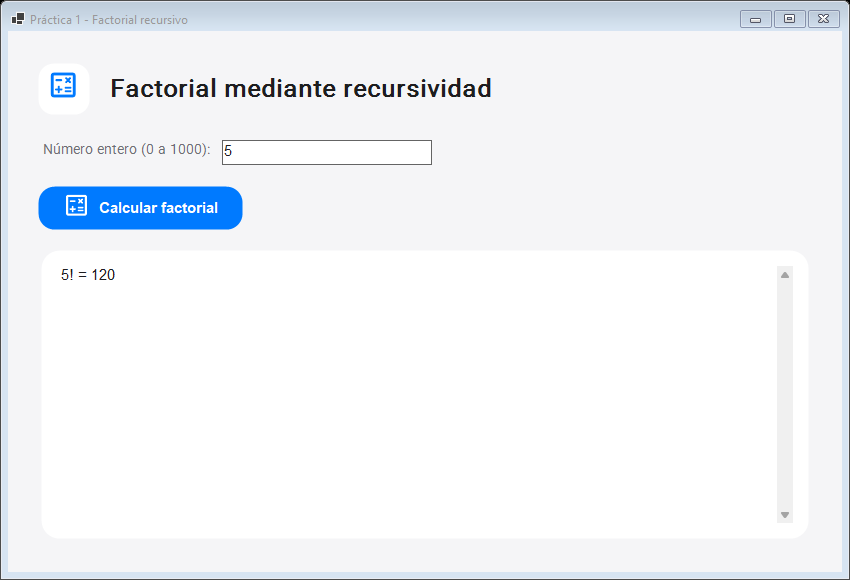

# Práctica 1: Factorial

Aplicación gráfica de Windows en C# (.NET 10, WinForms). Calcula el factorial de un entero no negativo mediante recursividad.



## Uso

Abre `publish/Practica_01_Factorial.exe`, escribe un entero entre 0 y 1000 y pulsa **Calcular factorial**. El resultado aparece en la tarjeta inferior. La aplicación avisa si la entrada es inválida.

## Código

- `FactorialRecursivo.cs`: casos base `0! = 1`, `1! = 1` y llamada recursiva `n × (n - 1)!`. Usa `BigInteger`.
- `Program.cs`: ventana, entrada, validación y presentación del resultado.
- `CupertinoTheme.cs`: estilos Cupertino, carga de Roboto y símbolos Material integrados.
- `Resources/`: fuentes y licencias correspondientes.

## Compilar y publicar

Desde esta carpeta, con el SDK de .NET 10:

```powershell
dotnet build -c Release
dotnet publish -c Release -r win-x64 --self-contained true -p:PublishSingleFile=true -o publish
```

El `.exe` publicado es una aplicación gráfica para Windows x64 y no necesita instalar .NET. Casos de referencia: `0! = 1`, `1! = 1`, `5! = 120`.
