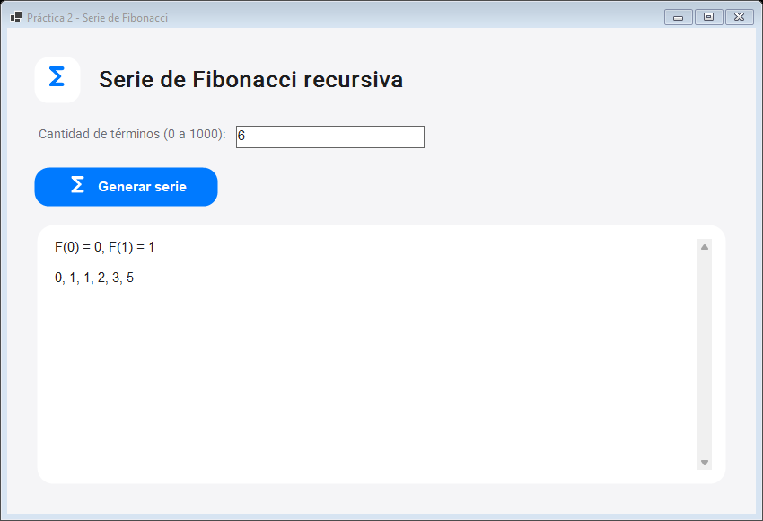

# Práctica 2: Serie de Fibonacci

Aplicación gráfica de Windows en C# (.NET 10, WinForms). Genera los primeros `n` términos de Fibonacci con recursividad y memoización.



## Uso

Abre `publish/Practica_02_Fibonacci.exe`, escribe una cantidad entera de términos entre 0 y 1000 y pulsa **Generar serie**. La serie empieza en `F(0) = 0`, `F(1) = 1`; para `n = 0`, se muestra una serie vacía.

## Código

- `FibonacciRecursivo.cs`: casos base y paso recursivo `F(k) = F(k-1) + F(k-2)`, con `BigInteger` y memoización.
- `Program.cs`: ventana, validación y presentación desplazable de la serie.
- `CupertinoTheme.cs`: estilos Cupertino, carga de Roboto y símbolos Material integrados.
- `Resources/`: fuentes y licencias correspondientes.

## Compilar y publicar

Desde esta carpeta, con el SDK de .NET 10:

```powershell
dotnet build -c Release
dotnet publish -c Release -r win-x64 --self-contained true -p:PublishSingleFile=true -o publish
```

El `.exe` publicado es una aplicación gráfica para Windows x64 y no necesita instalar .NET. Para `n = 6` muestra `0, 1, 1, 2, 3, 5`.
