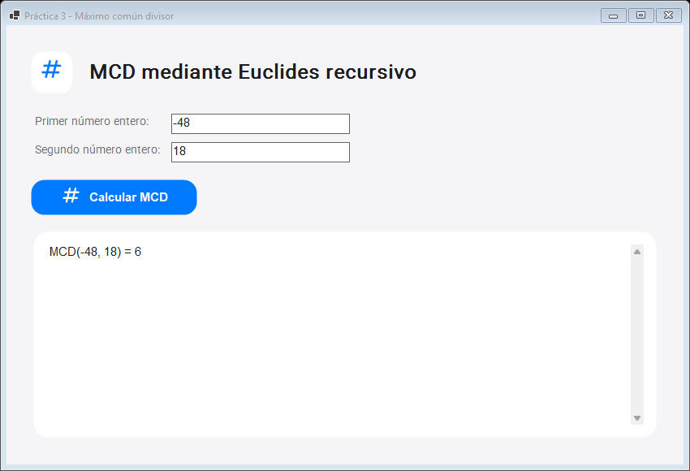

# Práctica 3: Máximo común divisor

Aplicación gráfica de Windows en C# (.NET 10, WinForms). Calcula el MCD de dos enteros mediante el algoritmo recursivo de Euclides.



## Uso

Abre `publish/Practica_03_MCD.exe`, escribe los dos enteros y pulsa **Calcular MCD**. Se aceptan negativos y cero, excepto la pareja `(0, 0)`, cuyo MCD no está definido.

## Código

- `McdRecursivo.cs`: caso base `b = 0` y paso recursivo `MCD(b, a % b)`. Usa `BigInteger` para manejar magnitudes sin desbordamiento.
- `Program.cs`: ventana, validación y presentación del resultado.
- `CupertinoTheme.cs`: estilos Cupertino, carga de Roboto y símbolos Material integrados.
- `Resources/`: fuentes y licencias correspondientes.

## Compilar y publicar

Desde esta carpeta, con el SDK de .NET 10:

```powershell
dotnet build -c Release
dotnet publish -c Release -r win-x64 --self-contained true -p:PublishSingleFile=true -o publish
```

El `.exe` publicado es una aplicación gráfica para Windows x64 y no necesita instalar .NET. Caso de referencia: `MCD(-48, 18) = 6`.
