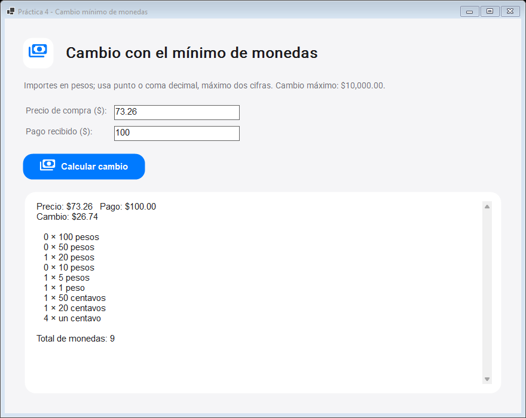

# Práctica 4: Cambio mínimo de monedas

Aplicación gráfica de Windows en C# (.NET 10, WinForms). Dado el precio y el pago, devuelve el cambio con el menor número de monedas de 100, 50, 20, 10, 5 y 1 peso; 50, 20 y 1 centavo.



## Uso

Abre `publish/Practica_04_Cambio_Minimo.exe`, escribe precio y pago en pesos con hasta dos decimales y pulsa **Calcular cambio**. Se admite punto o coma decimal. El pago debe cubrir el precio y el cambio máximo admitido es de $10,000.00.

## Código

- `CambioMinimoRecursivo.cs`: explora recursivamente las cantidades posibles por denominación, memoiza subproblemas y garantiza el mínimo global. Opera con centavos enteros.
- `Program.cs`: ventana, validación monetaria y desglose de las nueve denominaciones.
- `CupertinoTheme.cs`: estilos Cupertino, carga de Roboto y símbolos Material integrados.
- `Resources/`: fuentes y licencias correspondientes.

La elección voraz falla con estas monedas: para 60 centavos, tres monedas de 20 centavos son mejores que una de 50 y diez de 1 centavo. El ejemplo del documento (`73.26` pagado con `100.00`) devuelve `26.74` en nueve monedas.

## Compilar y publicar

Desde esta carpeta, con el SDK de .NET 10:

```powershell
dotnet build -c Release
dotnet publish -c Release -r win-x64 --self-contained true -p:PublishSingleFile=true -o publish
```

El `.exe` publicado es una aplicación gráfica para Windows x64 y no necesita instalar .NET.
