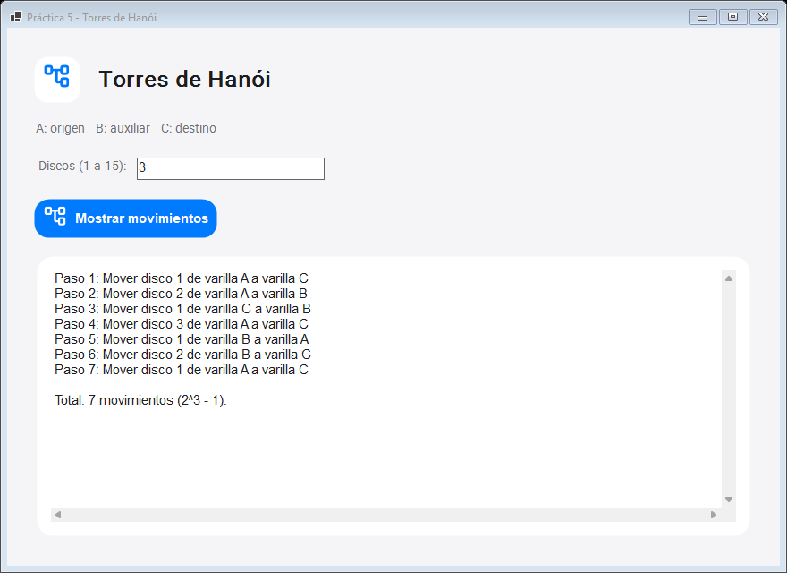

# Práctica 5: Torres de Hanói

Aplicación gráfica de Windows en C# (.NET 10, WinForms). Describe los movimientos recursivos para llevar todos los discos de la varilla `A` a la `C`, usando `B` como auxiliar.



## Uso

Abre `publish/Practica_05_Torres_Hanoi.exe`, escribe un número de discos entre 1 y 15 y pulsa **Mostrar movimientos**. La tarjeta inferior muestra cada paso y el total `2^n - 1`; la lista permite desplazamiento vertical.

## Código

- `HanoiRecursivo.cs`: caso base y descomposición recursiva clásica. Incluye un validador de las tres reglas de movimiento.
- `Program.cs`: ventana, validación y lista numerada de movimientos.
- `CupertinoTheme.cs`: estilos Cupertino, carga de Roboto y símbolos Material integrados.
- `Resources/`: fuentes y licencias correspondientes.

El límite de 15 discos acota la salida a 32,767 movimientos. Para tres discos, el resultado tiene siete movimientos válidos.

## Compilar y publicar

Desde esta carpeta, con el SDK de .NET 10:

```powershell
dotnet build -c Release
dotnet publish -c Release -r win-x64 --self-contained true -p:PublishSingleFile=true -o publish
```

El `.exe` publicado es una aplicación gráfica para Windows x64 y no necesita instalar .NET.
